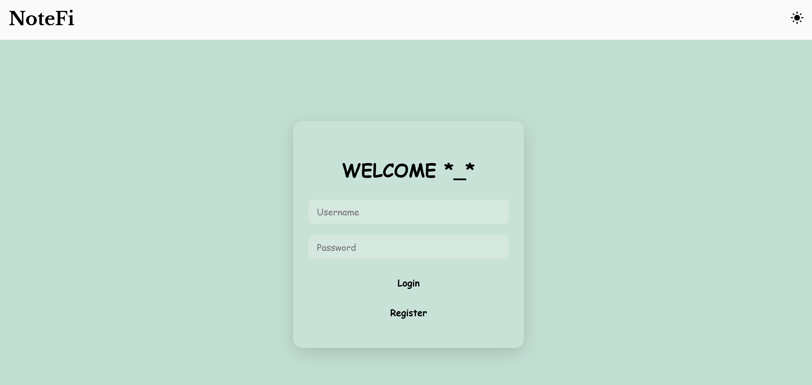
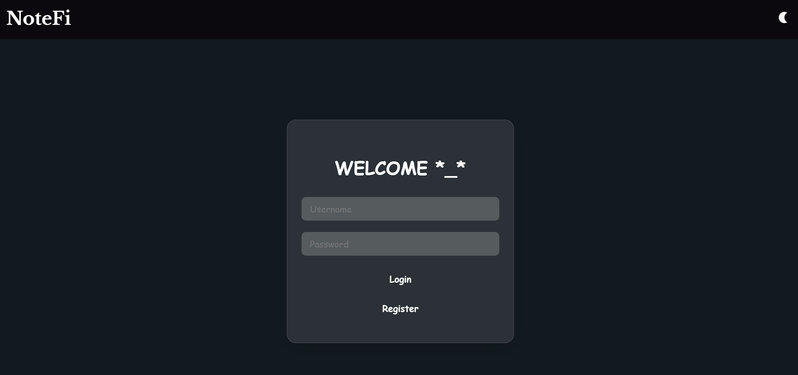
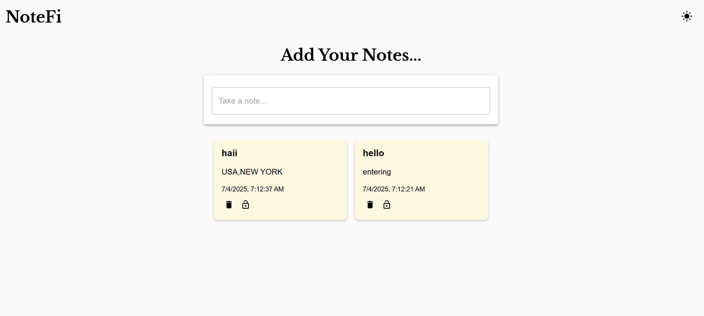
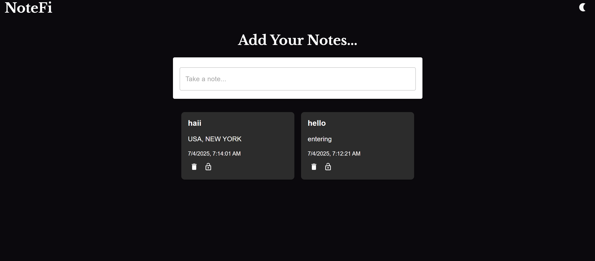

# 📝 NoteFi – A Secure Diary App

**NoteFi** is a simple, secure, and user-friendly diary app built with React and Node.js. Users can create, lock, and delete personal notes while enjoying features like Light/Dark mode and user-specific data isolation. All data is stored securely using PostgreSQL.

---

## Features

-  User registration & login with validation
-  Light and Dark mode toggle
- Create and view personal notes
- Lock and unlock notes using a password
- Delete notes permanently
- Alerts for incorrect password or duplicate usernames
- Notes are tied to the logged-in user only

---

## Tech Stack

| Layer      | Tech                          |
|------------|------------------------------ |
| Frontend   | React and CSS                 |
| Backend    | Node.js + Express             |
| Database   | PostgreSQL                    |

---

## Getting Started – Run Locally

### Prerequisites
- Node.js and npm
- PostgreSQL
- Git

---

### 1. Clone the Repository

# clone the repo
# Install Backend Dependencies & Run -> npm install,nodemon server.js
# open another terminal and Install Frontend Dependencies & Run -> npm install,npm run dev
# check localhost 5173

[

--images

